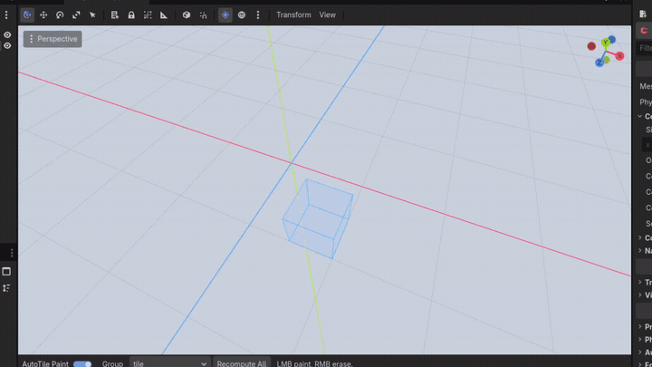
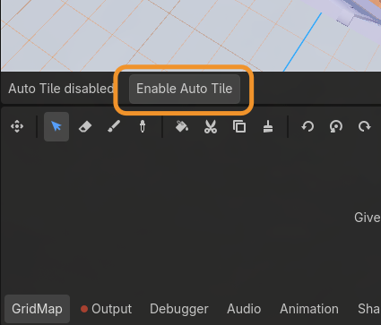
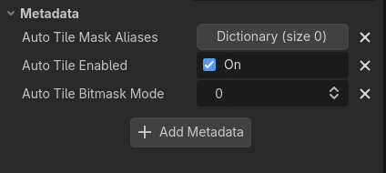

# GridMap AutoTile Demo

Godot has Auto Tile in Tilemap 2D, this plugin will bring the same capabilities in GridMap!



## Install

Download the library from [release page](https://github.com/damarindra/godot-autotile-gridmap/releases) and copy the contents into your Godot project:

- `bin/auto_tile.gdextension`
- the matching compiled library files from `bin/auto_tile/`

The `.gdextension` file uses relative paths, so keep the library folder next to it.

Example layout:

```text
your_project/
  bin/
	auto_tile.gdextension
	auto_tile/
	  libauto_tile.linux.editor.x86_64.so
	  ...
```

## Set Up Auto Tile

1. Add a `GridMap` to your scene.
2. Assign a `MeshLibrary` whose item names follow this format: `<group>_<bitmask>[-v<number>][-w<number>]`.
3. Select the `GridMap` in the editor.
4. Click `Enable Auto Tile` in the autotile toolbar.
5. Choose a bitmask mode: `XZ_4` or `XZ_8`.
6. Enable `AutoTile Paint`.
7. Pick a group such as `floor` or `wall`, then paint.



The plugin stores the bitmask mode in `metadata/auto_tile_bitmask_mode`:

- `0` = `XZ_4`
- `1` = `XZ_8`



## Required Tiles

Minimum authored masks for `XZ_4`:

```text
0, 1, 3, 5, 7, 15
```

Minimum authored masks for `XZ_8`:

```text
0, 1, 5, 7, 17, 21, 23, 29, 31, 85, 87, 95, 119, 127, 255
```

These are the minimum canonical masks. Rotation covers the rest.

## Example Assets

Example tiles are included in `gltf/`:

- `gltf/kenney_modular_dungeon_4bit.glb`
- `gltf/kenney_modular_dungeon_8bit.glb`
- `gltf/kaykit_dungeon_8bit.glb`

Use them as examples for how to prepare tilesets for `XZ_4` and `XZ_8` workflows.

## Asset Credits

- Kenney - Modular Dungeon Kit: https://www.kenney.nl/assets/modular-dungeon-kit
- KayKit - Dungeon Remastered: https://kaylousberg.itch.io/kaykit-dungeon-remastered
